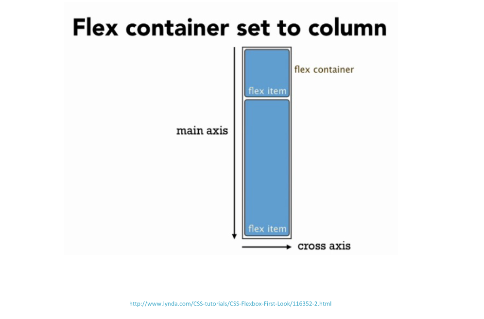
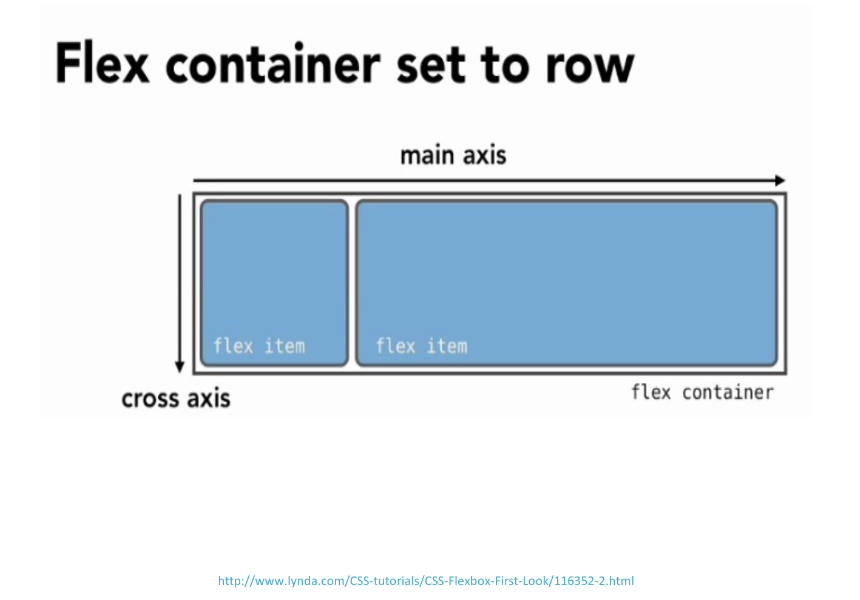

# Frontend Master CSS Grid and Flexbox for Responsive Layouts (v2)

## Responsive Design Overview

Ethan marcotte defined responsive design by three characteristics:
- Flexible grid-based layout.
- Media queries (CSS3).
- Images that resize.

When he came up with those concept, the only way to do layout on a webpage
were, pretty much two ways:
- A table-based layout.
- A float-based layout.

Fortunately flexbox has gone through several iterations and become well
supported by browsers, so the grid-based layout is much easier than it used to
be.

### Grid-based Layout

The concept is that we have some numbers of columns on the page, and then
we're going to group those columns into a unit, and that will become where we
actually display something on our webpage.

> The concept here comes from print design, where printers have thought about
> columns in terms of laying things out. It helps keep layout neat, clean, and
> flexible in a lot of ways.

### Images That Resize

Images should change sized based on screen resolution. In the previous course,
the instructor explained about picture element. And then in this course, we'll
talk about sized and source set.

### CSS Media Queries

For the most part, people have used media queries in terms of screen width,
minimum width, maximum width, and so forth. But media queries are much more
than that, especially in this day, we have a lot more types and media queries
that are supported.

Keep in mind that **when we work with media queries, media queries don't have
to be screen width**.

## Flexbox

Flexbox stands for flexible boxes and the specification was defined around
2008 or 2009.

The idea with flexbox was that it would lay out parts of webpages that flexbox
was for UI, as opposed to entire page layouts.

Flexbox is really good at vertical centering and an equal heights, and it's
really easy to reorder boxes.

The big disadvantage with flexbox is that it was never designed to be locked
down for the layouts. It's really a one dimensional type of layout. We can
think the one dimensional layout as rows.

If we look at the webpage today, we can see very much that people are thinking
about a row on the page, maybe it has some things inside of it, and another
row on the page with some other things, and so on.

That is because flexbox thinks about itself in terms of rows as opposed to
thinking of itself in two dimensions more like CSS grid.

A couple of piece of terminology what will helpful to us is the concept of
the main axis and the cross axis, the flex item and the flex containers.

To make things simple, flex containers are parents and flex items are
children.

If we set our main axis to column, we'll get this:
.

If we set our main axis to row, we'll get this:
.

### Container Flexbox Properties Demo

- first, set `display: flex;`.
- `flex-flow` is a combination of `flex-direction` and `flex-wrap`.
Example: `flex-flow: row wrap;`.
- `flex-direction` determine the direction of flex container.
- `flex-wrap` determine the wrapping direction of flex container.

- `justify-content` determine the spacing of flex container main axis.
Example: `justify-content: flex-start;`.
- `align-items` determine the spacing of flex container cross axis.
Example: `align-items: flex-start;`.
- `align-content` determine the spacing of flex item cross axis.
Example: `align-content: flex-start`.

### Child Flexbox Properties Demo

When we work with flexbox, we want to use `flex-basis` as the width
properties. When we use the `width` CSS property width, and we give it value
30%, it will never be 29.9% or 30.1%, it will always exactly 30%.

### Flexbox Grid System

The way we want to think about grid system with flexbox is that we're going to
have a series of boxes.

The critical part of grid system is that, we need to have the flex container
and the flex items in the html part.

> Check out the codepen on
> [course website](https://frontendmasters.github.io/grid-flexbox-v2/flexbox-grid-system)
> and try it out yourself.

## Responsive Images Best Practices

- Only one image should load, even if many are specified.

Bad example:
```html
<div class="fakeresponsive">
  
  
</div>
```

```css
@media (max-width: 500px) {
  .tiny { display: none; };
}
@media (max-width: 500px) {
  .big { display: none; };
}
```

Even if they're set to `display: none`, both of those images are going to
load. We actually made our web page load more slowly than we would have if
we just stuck with one image and just reframed it.

Use cautiously example:
```html

```

```css
img {
  width: 100%;
  max-width: 800px;
}
```

What that will do is give our image flexibility within the space. The problem
here is that we have one image that loads regardless of what device we're
using, regardless of the speed of the connection, and that is going to cost
a potentially very large image to download to a mobile device, for example.

- `<picture>`: we decide which image to display.
- `srcset` and `sizes`: the browser decides which image.

## CSS Grid

### Why CSS Grid?

Why would we ever wanna use CSS grid when flexbox seem pretty good?

First of all, it's built in the CSS specification, just like flexbox, so it's
a legit way of laying out web pages, unlike float, table-based layout, and all
the other hacks that we've used in the history of CSS.

The other interesting thing about Grid is that there's no row markup required.
In the past, we have written a lot of row markup, but now, with Grid we don't
have to do that anymore because we can specify our layouts in two dimensions.

**Use Flexbox and Grid where they make they most sense**. Rather than trying
to dogmatically stick to Grid for major layout on web pages and then Flexbox
for the UI inside of various cells, use what works, where it works best,
because there's strength and weekness to Grid or Flexbox.

**Grid cells can occupy the same space**.

> [Mondrian painting exercise](https://codepen.io/jen4web/pen/mdmagoP?editors=1100).

## Extra Notes

### Content Box

**The way CSS configured is start off with a so called Content Box, and
it has to do with how we determine the value of the CSS property width**.
Are we going to include the width of the border and the width of the padding
plus the width of the content to determine the value of that property called
*width*. Or, are we just gonna say "it's the width of the content itself".

So, the content box determine the width of the content itself is the value
of the width property. And, the border box determine the border and the
padding is the value of the width property.

> It's much easier for math if you use the border box.

### Images

Images are an inline element. By default, the image set to be as wide as the
image itself. And, if we make the screen too small, we will start to get a
scroll bar on the bottom (we have to scroll over to see the rest of the
image).

When we put a width of 100% on our images, they will expand to fill their
container, and they will also shrink down proportionately. This is a fake
responsive image, not a true responsive image.

## Q&A

- How do we decide on the media queries for my projects?

> What looks good, in other words, we don't tie our media queries devices
> because devices changes every single day of the week. It's not gonna be like
> the old days where we can say definitively where exactly certain media
> queries should be set.
>
> Furthermore, we can have media queries for one part of the page, because
> that part of the page needs a certain set of media queries, then another
> part of the page, maybe have a different set of media queries associated
> with it to make it look good across breakpoints.
>
> This is part of fragmenting the approach to responsive design, so that
> you can focus on smaller parts of our page instead of media queries to
> control that part of the page to make each element on the page look optimal
> in its layout.

- What is the difference between `stretch` in flexbox and `max-height` or
`min-height` or something like that?

> Back in the days when we did out layouts with floats, by default the height
> of our elements are as tall as our content. So, how tall the content in the
> particular box, that's how tall that box is.
>
> The CSS property height measurement can artificially make that box taller
> (we can also use max or min height to control a little bit of that height),
> but recall that is for one particular box.
>
> What flexbox will do is, within that particular set of boxes when we use the
> stretch property, it will stretch to make those boxes as tall as the longest
> piece of content, and then equalize all of the boxes in the row to that same
> height.

- What is the difference between `min-width` and `max-width` in media queries?

> `min-width`<br>
> When we're writing mobile first, what we want to do is use all `min-width`
> the whole way through. So, we start with our declarations outside of the
> media queries, that's our mobile style. And then we're going to change
> whatever needs changing through the media queries.
>
> We use `min-width` because that pulls in the styles outside the media
> query, and they are still valid when we go to the next media query, and
> they are still valid all the way through the document until we reset the
> value somewhere along the way.
>
> `max-width`<br>
> When we're writing desktop first, all the styles outside of media queries
> are desktop styles and then we're going to cut off whatever those styles are
> at various breakpoints by using `max-width` media queries.

- What is `object-fit` and `object-position`?

> `object-fit` will determine how the image is going to display within the
> space. While the `object-position` move things in space.

## References

- [Course website](https://frontendmasters.github.io/grid-flexbox-v2).
- [Course repo](https://github.com/frontendmasters/grid-flexbox-v2).
- [Ethan marcotte responsive design post](https://alistapart.com/article/responsive-web-design).
- [Ethan marcotte responsive design and container queries post](https://ethanmarcotte.com/wrote/responsive-design-at-11-container-queries).
- [Flexbox froggy game](https://flexboxfroggy.com/).
- [Flexbox defense game](http://www.flexboxdefense.com/).
- [Flexbox css-trick webpage](https://css-tricks.com/snippets/css/a-guide-to-flexbox/).
- [Course repo flexbox text file reference](https://github.com/FrontendMasters/grid-flexbox-v2/blob/main/day-1-flexbox/1-flexbox-intro/Flexbox%20Properties.txt).
- [Px, rem, and em explanation](https://css-tricks.com/rems-ems/).
- [Responsive image breakpoints generator](https://responsivebreakpoints.com/).
- [CSS grid layout detailed explanation](https://drafts.csswg.org/css-grid/).
- [CSS grid game](https://cssgridgarden.com/).
